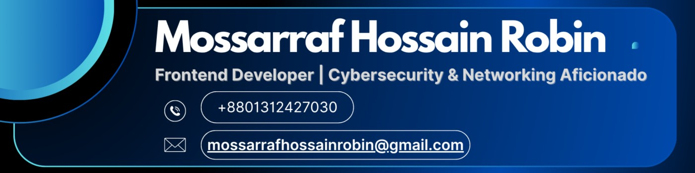
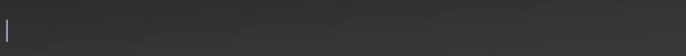

 

🎓 **Computer Science and Engineering Student** at **Green University of Bangladesh, Dhaka**  
💻 **Frontend Developer | Cybersecurity Enthusiast | Problem Solver**  
🌱 *Passionate about creating innovative solutions, breaking complex challenges, and continuous learning.*

---

## 📌 About Me

I am **Mossarraf Hossain Robin**, a passionate **Frontend Developer** with expertise in building responsive, dynamic, and user-friendly websites using **modern web technologies**. I have been freelancing since **2019**, solving real-world problems with clean, scalable, and optimized code.

Apart from development, I am highly interested in **Cybersecurity** and **Network Defense**. I am committed to improving my problem-solving skills through **Data Structures, Algorithms, and System Design**. My career goal is to become a **versatile Software Engineer and Cybersecurity Specialist**.

---

## 💻 Tech Stack

  

  

---

## 🛠 Tools & IDEs

---
## 🚀 Featured Projects

#### Explore my top projects showcasing web development skills and responsive design:

<table style="border-collapse: collapse; width: 100%;">
  <thead>
    <tr style="background-color: #f4f4f4; text-align: left;">
      <th style="padding: 8px; border-bottom: 2px solid #ddd;">Project</th>
      <th style="padding: 8px; border-bottom: 2px solid #ddd;">Description</th>
      <th style="padding: 8px; border-bottom: 2px solid #ddd;">Tech Stack</th>
      <th style="padding: 8px; border-bottom: 2px solid #ddd;">Repository</th>
      <th style="padding: 8px; border-bottom: 2px solid #ddd;">Visit Site</th>
    </tr>
  </thead>
  <tbody>
    <tr>
      <td><b>MyPortfolio</b></a></td>
      <td>Portfolio showcasing skills & projects</td>
      <td>  
        
        
        
        
       </td>
     <td>
        
      </td>
      <td>
        
      </td>
    </tr>
    <tr>
      <td><b>OneBite</b></a></td>
      <td>Online Food ordering system</td>
      <td>  
        
        
        
        
        
        </td>
      <td></td>
      <td></td>
    </tr>
    <tr>
      <td><b>Elite Footwear</b></a></td>
      <td>Online shoe store & cart</td>
      <td>  
        
        
        
        
        
        </td>
      <td></td>
      <td></td>
    </tr>
    <tr>
      <td><b>Prottoy Foundation</b></a></td>
      <td>Charity & awareness platform</td>
      <td style="padding: 8px; border-bottom: 1px solid #ddd;">  
        
        
        
        
        
        </td>
      <td ></td>
      <td ></td>
    </tr>
  <tr>
  <td><b>Line Coding Visualizer</b></td>
  <td>
    Educational line coding simulator
  </td>
  <td style="padding: 8px; border-bottom: 1px solid #ddd;">  
    
    
    
    
  </td>
  <td>
    
  </td>
  <td>
    
  </td>
</tr>
<tr>
  <td><b>Inventory Management System</b></td>
  <td>
    Java inventory management system with admin dashboard and order tracking
  </td>
  <td style="padding: 8px; border-bottom: 1px solid #ddd;">  
    
    
  </td>
  <td>
    
  </td>
  <td>
    
  </td>
</tr>
<tr>
  <td><b> Array Multiplier</b></td>
  <td>
    Binary array multiplier with visual step tracking and sign handling
  </td>
  <td style="padding: 8px; border-bottom: 1px solid #ddd;">  
    
    
    
    
    
  </td>
  <td>
    
  </td>
  <td>
    
  </td>
</tr>

<tr>
  <td><b>NetOptima</b></td>
  <td>
    Networking & IP Analyzer
  </td>
  <td style="padding: 8px; border-bottom: 1px solid #ddd;">  
    
    
    
    
    
    
  </td>
  <td>
    
  </td>
  <td>
    
  </td>
</tr>
<tr>
  <td><b>NetOptima Prototype</b></td>
  <td>
    Networking & IP Analyzer-2.0.1
  </td>
  <td style="padding: 8px; border-bottom: 1px solid #ddd;">  
    
    
    
    
    
    
  </td>
  <td>
    
  </td>
  <td>
    
  </td>
</tr>
<tr>
  <td><b>AgroCulture</b></td>
  <td>
    Smart Agricultural Marketplace
  </td>
  <td style="padding: 8px; border-bottom: 1px solid #ddd;">  
    
    
    
    
    
    
  </td>
  <td>
    
  </td>
  <td>
    
  </td>
</tr>

  </tbody>
</table>

---

## [📚 Educational Hub](https://github.com/MossarrafHossainRobin/Educational-Resources)

<table>
  <thead>
    <tr>
      <th>📁 Type</th>
      <th>📌 Title</th>
      <th>📝 Description</th>
      <th>📄 Format</th>
      <th>🔗 Link</th>
    </tr>
  </thead>
  <tbody>
       <tr>
      <td>Books</td>
      <td> Cyber Security </td>
      <td> Textbook </td>
      <td>
       
      </td>
      <td>
        
      </td>
    </tr>
    <tr>
      <td>Assignment</td>
      <td>Web Programming Assignment</td>
      <td>Creating a user registration form with frontend validation and Bootstrap styling.</td>
      <td>
        
        
        
        
      </td>
      <td>
        
      </td>
    </tr>
        <tr>
      <td>Template</td>
      <td>LaTeX Lab Report Template</td>
      <td>A professional LaTeX template for writing structured lab reports with pre-defined sections, cover page, and formatting — ideal for university assignments.</td>
      <td>
        
        
      </td>
      <td>
        
      </td>
    </tr>
  </tbody>
</table>

#### Check out more projects on my [GitHub](https://github.com/mossarrafhossainrobin?tab=repositories)!
---

  

## 📊 GitHub Stats

<table align="center">
  <tr>
    <td>
      
    </td>
    <td>
      
    </td>
    <td>
      
    </td>
  </tr>
</table>

---

## 📈 Detailed Statistics

<table align="center">
  <tr>
    <td>
      
    </td>
    <td>
      
    </td>
  </tr>
</table>

---

## ⚡ Activity Graph

---

