

<h3>🎓 CSE Student | Full-Stack Developer | Cybersecurity Enthusiast</h3>

  Building modern, responsive, secure, and scalable web applications.

 

## 📌 About Me

I am <b>Mossarraf Hossain Robin</b>, a passionate 

and <b>Computer Science and Engineering student</b> focused on building modern, responsive, secure, and scalable web applications.

I enjoy transforming real-world problems into practical digital solutions using clean UI design, structured backend logic, database management, authentication systems, dashboard features, and user-friendly workflows.

My development stack includes **React.js, Next.js, JavaScript, Tailwind CSS, Firebase, Firestore, Node.js, Express.js, MongoDB, MySQL, PHP, and REST APIs**. I work on both frontend and backend parts to build complete, functional, and production-ready web applications.

I am also deeply interested in **Cybersecurity**, secure coding practices, authentication, data protection, and building applications that are not only beautiful but also reliable and safe for users.

---

## 💻 Tech Stack

  
  
  
  
  
  
  

  
  
  
  
  
  
  

  
  
  
  
  
  
  
  

  
  
  
  
  
  
  
  
  
  

---

## 🚀 Featured Projects

<b>Selected projects showcasing full-stack development, responsive UI, database integration, dashboards, and real-world problem solving.</b>

 

<table>
<thead>
<tr>
<th>Project</th>
<th>Description</th>
<th>Tech Stack</th>
<th>Repository</th>
<th>Live Site</th>
</tr>
</thead>
<tbody>

<tr>
<td><b>KaazBazar</b></td>
<td>Service marketplace platform for local service booking and management.</td>
<td>

</td>
<td>

</td>
<td>

</td>
</tr>
<tr>
<td><b>KaazBazar Prototype</b></td>
<td>Prototype version of a service marketplace platform for local service booking, provider management, and user-friendly service browsing.</td>
<td>

</td>
<td>

</td>
<td>

</td>
</tr>

<tr>
<td><b>NestHub</b></td>
<td>Upgraded version of Meal App 25 with modern meal, bazar, member, cost, duty, and shared living management features using a Next.js-based interface.</td>
<td>

</td>
<td>

</td>
<td>

</td>
</tr>

<tr>
<td><b>Meal App 25</b></td>
<td>Bazar, meal count, monthly cost, duty, alerts, and member activity system.</td>
<td>

</td>
<td>

</td>
<td>

</td>
</tr>

<tr>
<td><b>NetOptima</b></td>
<td>Browser-based network diagnostic dashboard and IP analyzer.</td>
<td>

</td>
<td>

</td>
<td>

</td>
</tr>

<tr>
<td><b>AgroCulture</b></td>
<td>Agricultural marketplace for farmers and buyers.</td>
<td>

</td>
<td>

</td>
<td>

</td>
</tr>

<tr>
<td><b>MyPortfolio</b></td>
<td>Personal portfolio website showcasing skills, projects, and contact information.</td>
<td>

</td>
<td>

</td>
<td>

</td>
</tr>

<tr>
<td><b>OneBite</b></td>
<td>Restaurant website with online food ordering and responsive menu browsing.</td>
<td>

</td>
<td>

</td>
<td>

</td>
</tr>

<tr>
<td><b>Elite Footwear</b></td>
<td>Online shoe store with product browsing, cart, and purchase features.</td>
<td>

</td>
<td>

</td>
<td>

</td>
</tr>

<tr>
<td><b>Prottoy Foundation</b></td>
<td>Charity platform with donation, awareness, event, and volunteer sections.</td>
<td>

</td>
<td>

</td>
<td>

</td>
</tr>

<tr>
<td><b>Line Coding Visualizer</b></td>
<td>Educational simulator for visualizing digital line coding techniques.</td>
<td>

</td>
<td>

</td>
<td>

</td>
</tr>

<tr>
<td><b>Inventory System</b></td>
<td>Java-based inventory system with admin dashboard and order tracking.</td>
<td>

</td>
<td>

</td>
<td>

</td>
</tr>

<tr>
<td><b>Array Multiplier</b></td>
<td>Binary array multiplier with visual steps and sign handling.</td>
<td>

</td>
<td>

</td>
<td>

</td>
</tr>

</tbody>
</table>

---

## 📚 Educational Hub

<table>
<thead>
<tr>
<th>Type</th>
<th>Title</th>
<th>Description</th>
<th>Format</th>
<th>Link</th>
</tr>
</thead>
<tbody>
<tr>
<td>Books</td>
<td><b>Cyber Security</b></td>
<td>Cybersecurity textbook and learning resources.</td>
<td></td>
<td>

</td>
</tr>
<tr>
<td>Assignment</td>
<td><b>Web Programming</b></td>
<td>User registration form with validation and Bootstrap styling.</td>
<td>

</td>
<td>

</td>
</tr>
<tr>
<td>Template</td>
<td><b>LaTeX Lab Report</b></td>
<td>Professional LaTeX template for university lab reports.</td>
<td>

</td>
<td>

</td>
</tr>
</tbody>
</table>

---

## 📊 GitHub Stats

<table align="center">
<tr>
<td align="center" width="50%">
  <b>GitHub Overview</b> 
  
</td>
<td align="center" width="50%">
  <b>Most Used Languages</b> 
  
</td>
</tr>
<tr>
<td align="center" colspan="2">
  <b>Contribution Streak</b> 
  
</td>
</tr>
</table>

---

## 📈 Detailed Statistics

<table align="center">
<tr>
<td align="center" colspan="2">
  <b>Profile Summary</b> 
  
</td>
</tr>
<tr>
<td align="center" width="50%">
  <b>Productive Time</b> 
  
</td>
<td align="center" width="50%">
  <b>Repositories Per Language</b> 
  
</td>
</tr>
<tr>
<td align="center" width="50%">
  <b>Commits Per Language</b> 
  
</td>
<td align="center" width="50%">
  <b>Profile Details</b> 
  
</td>
</tr>
</table>

---

## ⚡ Activity Graph

<table align="center">
<tr>
<td align="center">

</td>
</tr>
</table>

---

---

## KaajBazar Prototype Project Showcase

  <b>KaajBazar Prototype</b> is a modern service marketplace web application where users can explore professional services, find skilled workers, view expert profiles, send hire requests, and interact through a clean service-based platform.

  
  
  

  
  
  
  

  
  

### Desktop Views

<table>
  <tr>
    <td align="center" colspan="2">
      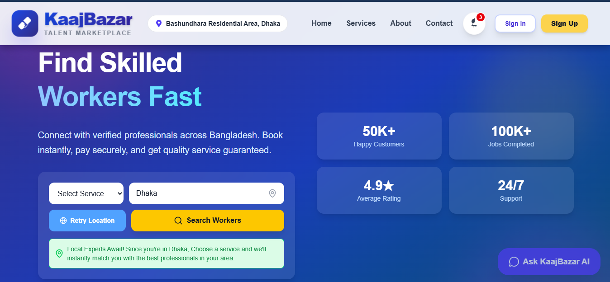
       
      <b>Home Page</b>
       
      Hero section with service search, location, statistics, and modern landing interface.
    </td>
  </tr>

  <tr>
    <td align="center" width="50%">
      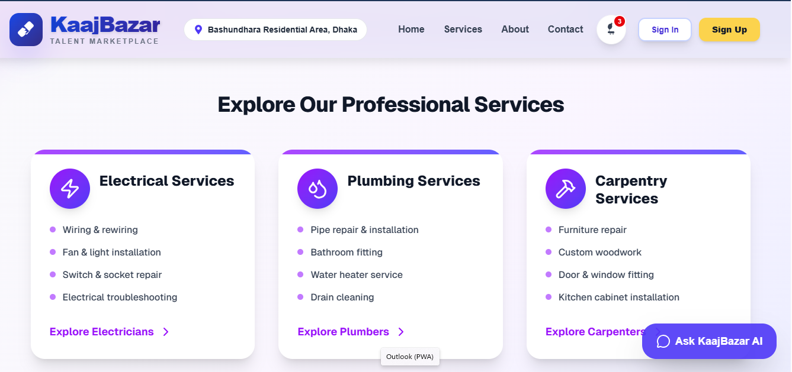
       
      <b>Explore Services</b>
       
      Professional service category cards with clean spacing and highlighted actions.
    </td>
    <td align="center" width="50%">
      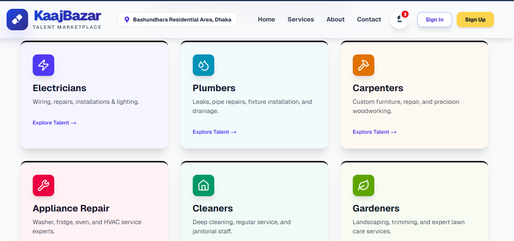
       
      <b>Service Categories</b>
       
      Service category layout for electricians, plumbers, carpenters, cleaners, gardeners, and appliance repair.
    </td>
  </tr>

  <tr>
    <td align="center" width="50%">
      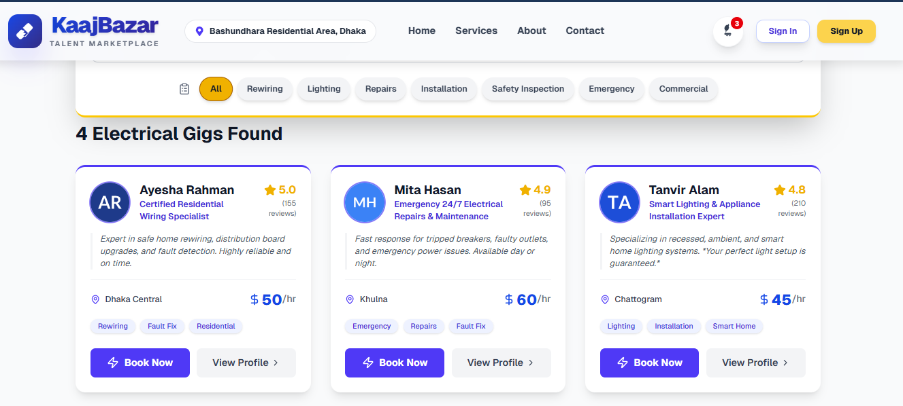
       
      <b>Electrical Services</b>
       
      Expert cards with ratings, hourly price, location, service tags, booking, and profile actions.
    </td>
    <td align="center" width="50%">
      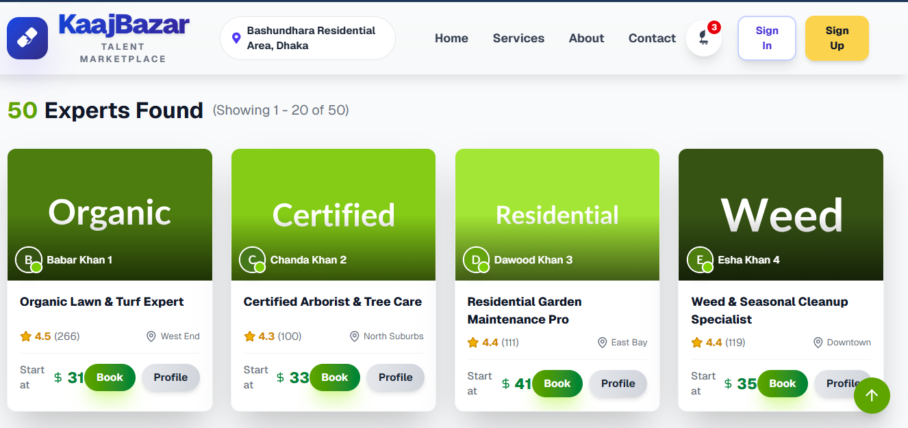
       
      <b>Gardening Experts</b>
       
      Grid-based expert listing with colorful service cards and strong visual hierarchy.
    </td>
  </tr>

  <tr>
    <td align="center" width="50%">
      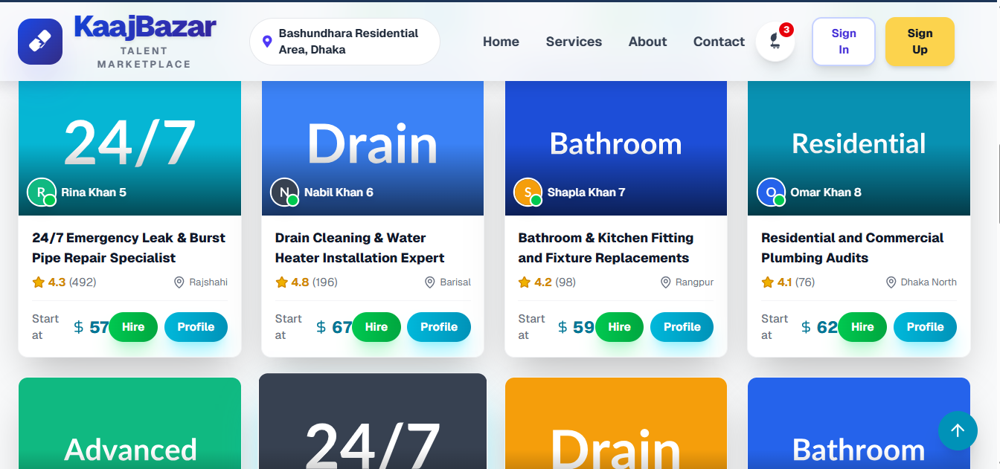
       
      <b>Plumbing Services</b>
       
      Plumber and repair expert listing with responsive desktop card layout.
    </td>
    <td align="center" width="50%">
      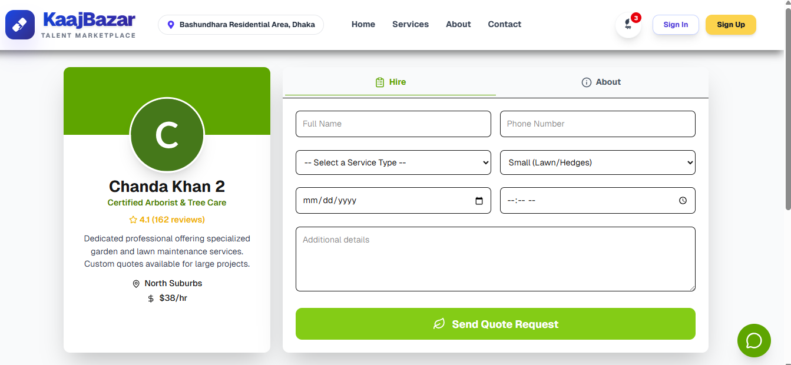
       
      <b>Expert Profile & Hire Request</b>
       
      Profile details, hire form, service type, schedule, and quote request flow.
    </td>
  </tr>

  <tr>
    <td align="center" width="50%">
      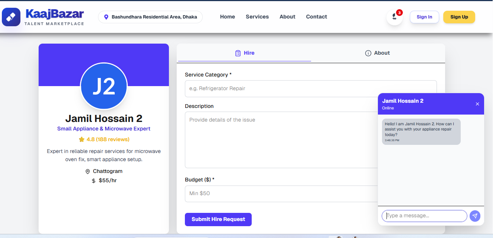
       
      <b>Appliance Repair Booking</b>
       
      Detailed hire request form with live chat widget and service issue description.
    </td>
    <td align="center" width="50%">
      
       
      <b>Login Page</b>
       
      Simple authentication interface with email/phone login and account navigation.
    </td>
  </tr>

  <tr>
    <td align="center" colspan="2">
      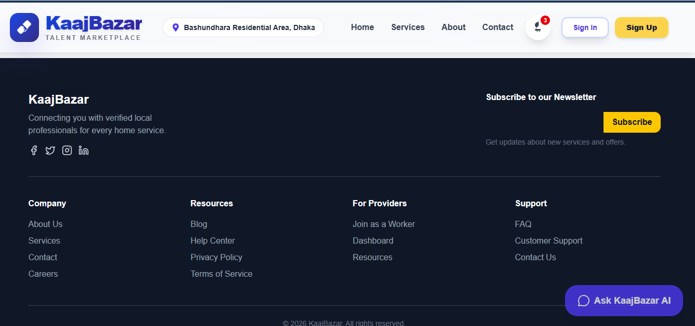
       
      <b>Footer & Newsletter Section</b>
       
      Dark footer with newsletter subscription, social links, provider resources, support links, and AI assistant button.
    </td>
  </tr>
</table>---

## NestHub Project Showcase

  
  
  

  <b>NestHub</b> is an upgraded version of <b>MealApp25</b>, built as a modern smart meal operation platform for managing meals, bazar, bills, members, dashboard analytics, real-time chat, notifications, and admin workflows.

  
  
  
  

  
  

---

### System Modules Overview

<table>
  <tr>
    <td align="center">
      
    </td>
    <td align="center">
      
    </td>
  </tr>
  <tr>
    <td align="center">
      
    </td>
    <td align="center">
      
    </td>
  </tr>
</table>

---

### User Panel Views

<table>
  <tr>
    <td align="center" colspan="2">
      <h3>Home Overview</h3>
      <kbd>
        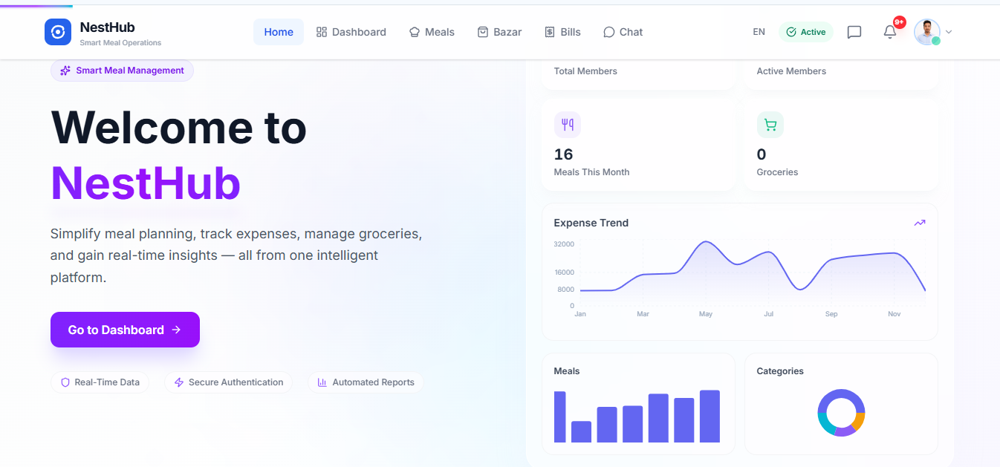
      </kbd>
       
      <b>Landing & Smart Meal Overview</b>
       
      Modern home page with dashboard entry, real-time data, secure authentication, automated reports, and visual analytics.
    </td>
  </tr>

  <tr>
    <td align="center" width="50%">
      <h3>User Dashboard</h3>
      <kbd>
        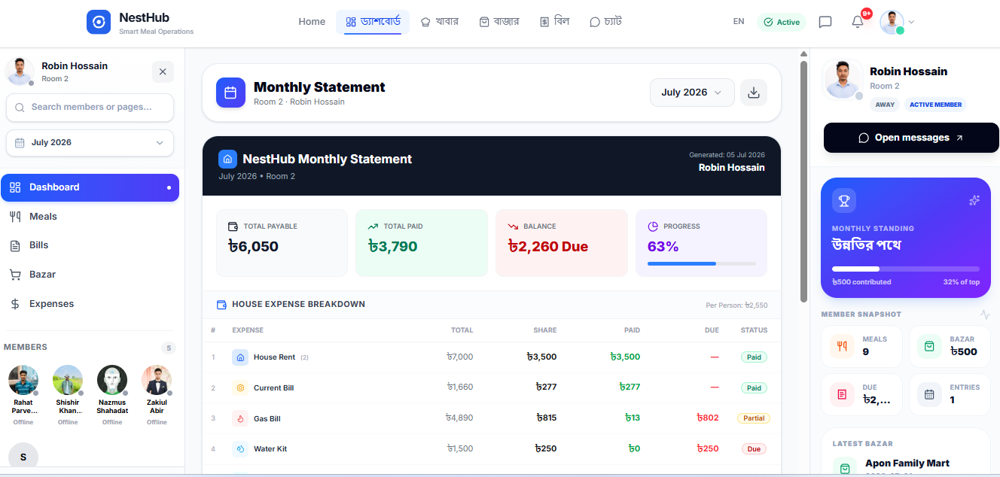
      </kbd>
       
      <b>Monthly Statement Dashboard</b>
       
      User dashboard with total payable, paid amount, balance, progress, monthly standing, member snapshot, and latest bazar updates.
    </td>
    <td align="center" width="50%">
      <h3>Collapsed Dashboard View</h3>
      <kbd>
        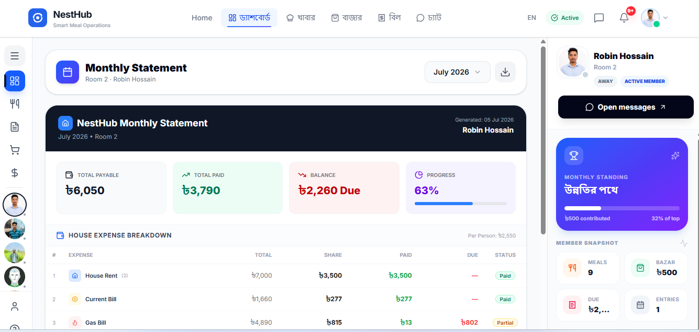
      </kbd>
       
      <b>Compact Dashboard Layout</b>
       
      Collapsed sidebar layout with monthly statement, member list, status cards, and quick access panel.
    </td>
  </tr>

  <tr>
    <td align="center" width="50%">
      <h3>User Meals</h3>
      <kbd>
        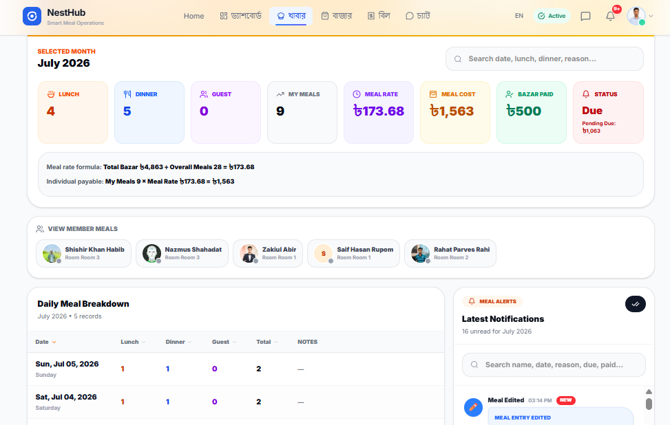
      </kbd>
       
      <b>Meal Breakdown</b>
       
      Monthly meal summary with lunch, dinner, guest meals, meal rate, meal cost, bazar paid, due status, and meal alerts.
    </td>
    <td align="center" width="50%">
      <h3>User Bazar</h3>
      <kbd>
        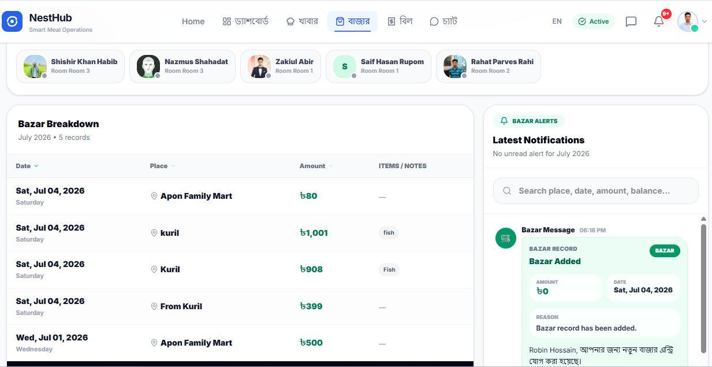
      </kbd>
       
      <b>Bazar Breakdown</b>
       
      User bazar records with date, place, amount, notes, latest notifications, and bazar message updates.
    </td>
  </tr>

  <tr>
    <td align="center" width="50%">
      <h3>User Bills</h3>
      <kbd>
        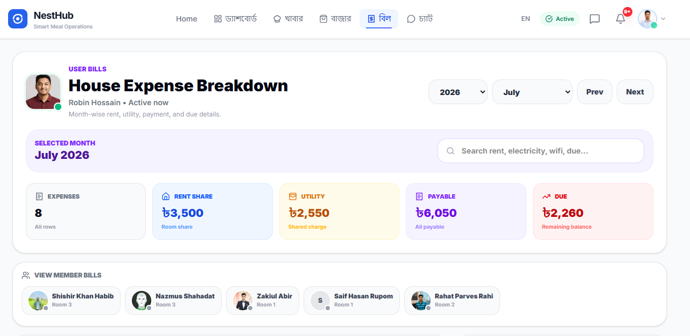
      </kbd>
       
      <b>House Expense Breakdown</b>
       
      Month-wise rent, utility, payable, due, expense count, selected month filter, and member bill view.
    </td>
    <td align="center" width="50%">
      <h3>User Chat</h3>
      <kbd>
        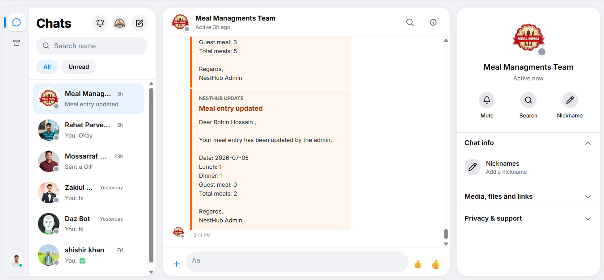
      </kbd>
       
      <b>Messenger Style Chat</b>
       
      Real-time chat interface with conversation list, unread filter, message thread, notification update, nickname option, and privacy controls.
    </td>
  </tr>
</table>

---

### Admin Panel Views

<table>
  <tr>
    <td align="center" width="50%">
      <h3>Admin Members</h3>
      <kbd>
        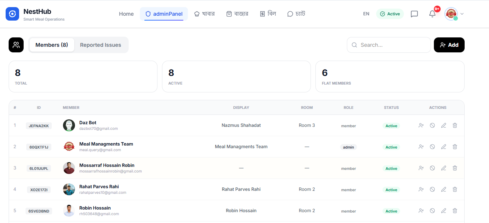
      </kbd>
       
      <b>Member Management</b>
       
      Admin member control with total users, active members, flat members, member table, role, room, status, search, and action tools.
    </td>
    <td align="center" width="50%">
      <h3>Admin Meals</h3>
      <kbd>
        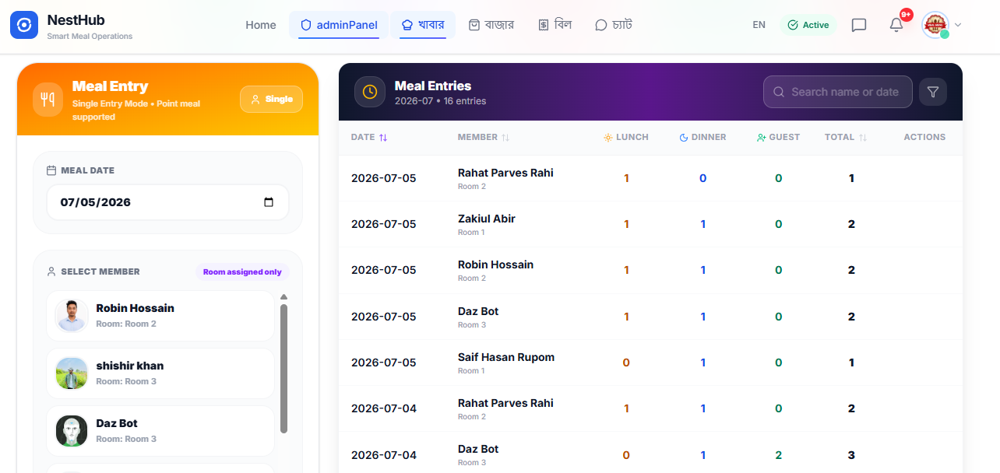
      </kbd>
       
      <b>Meal Entry Management</b>
       
      Meal entry form with member selection, date, lunch, dinner, guest count, and meal entries table with admin controls.
    </td>
  </tr>

  <tr>
    <td align="center" width="50%">
      <h3>Admin Bazar</h3>
      <kbd>
        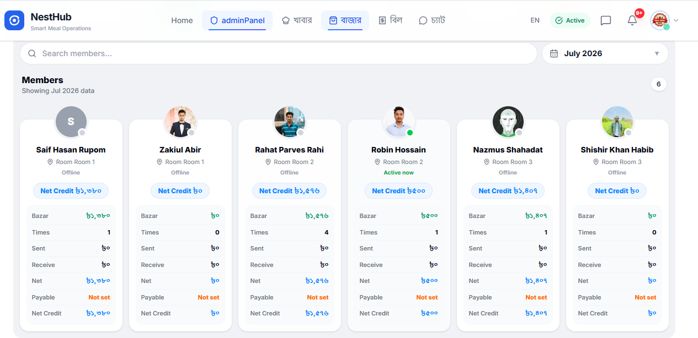
      </kbd>
       
      <b>Bazar Management</b>
       
      Admin bazar dashboard with searchable member cards, month filter, member-wise bazar, payments, payable, net credit, and status overview.
    </td>
    <td align="center" width="50%">
      <h3>Admin Bills</h3>
      <kbd>
        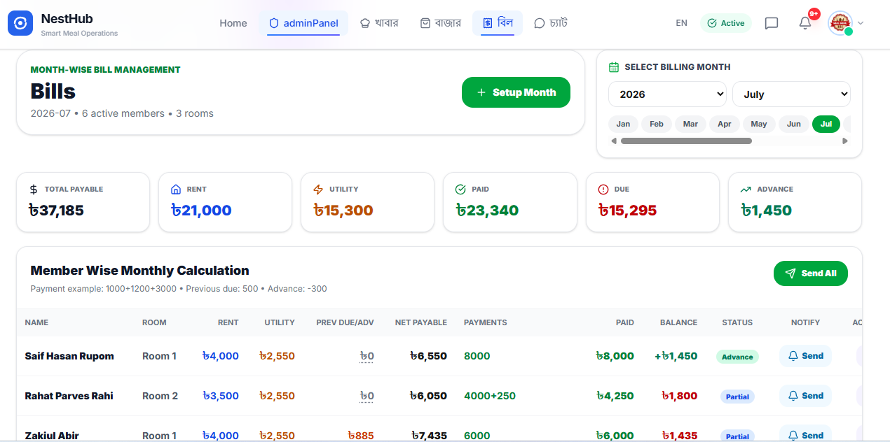
      </kbd>
       
      <b>Bill Management</b>
       
      Month-wise bill management with total payable, rent, utility, paid, due, advance, and member-wise monthly calculation.
    </td>
  </tr>
</table>

---

### Footer View

<table>
  <tr>
    <td align="center" colspan="2">
      <h3>NestHub Footer Section</h3>
      <kbd>
        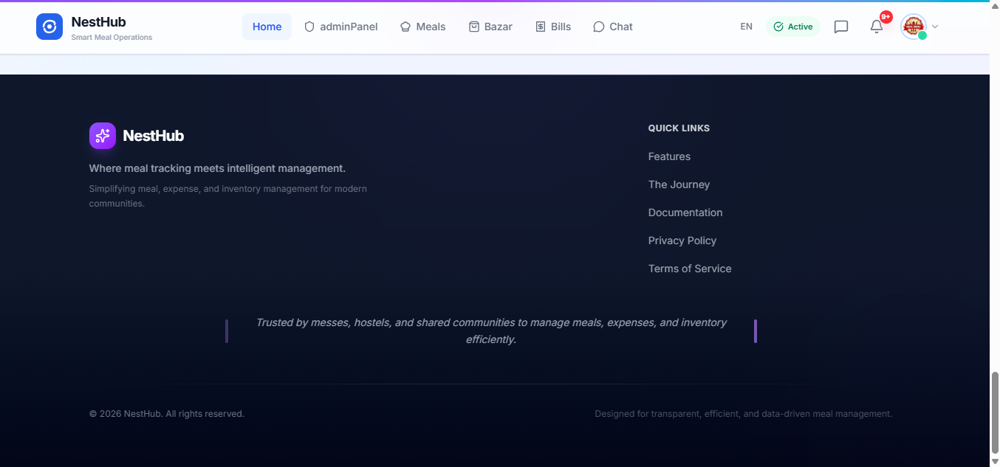
      </kbd>
       
      <b>Footer & Quick Links</b>
       
      Dark modern footer with brand identity, quick links, trusted community message, copyright information, and professional closing layout.
    </td>
  </tr>
</table>

## MealApp25 Project Showcase

 

  
  
  

  <b>MealApp25</b> is a complete meal, bazar, cost, water duty, payment, alert, settlement, and member management system designed for shared living, hostel, mess, and flat expense management.

  
  
  
  
  

  
  

---

### System Modules Overview

<table>
  <tr>
    <td align="center">
      
    </td>
    <td align="center">
      
    </td>
  </tr>
  <tr>
    <td align="center">
      
    </td>
    <td align="center">
      
    </td>
  </tr>
</table>

---

### User Panel Views

<table>
  <tr>
    <td align="center" colspan="2">
      <h3>Dashboard Overview</h3>
      <kbd>
        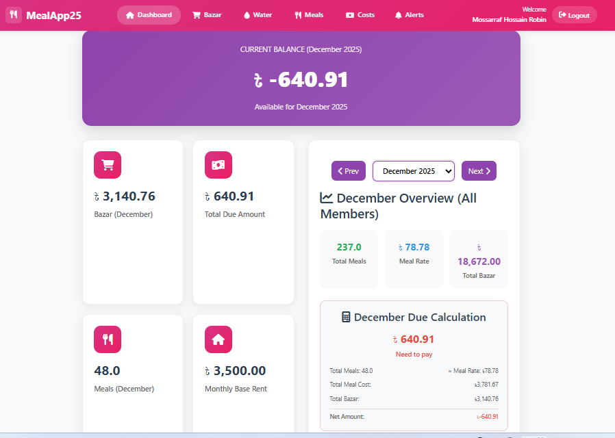
      </kbd>
       
      <b>User Dashboard</b>
       
      Monthly balance, bazar cost, meal count, rent, due calculation, and member overview.
    </td>
  </tr>

  <tr>
    <td align="center" width="50%">
      <h3>User Login</h3>
      <kbd>
        
      </kbd>
       
      <b>Member Login Interface</b>
       
      Clean sign-in page for members to access meal and expense dashboard.
    </td>
    <td align="center" width="50%">
      <h3>Meal Tracker</h3>
      <kbd>
        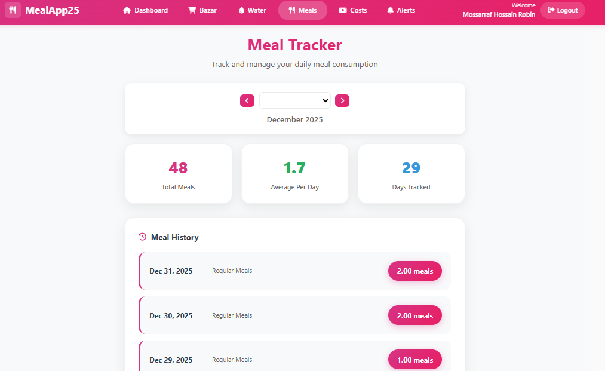
      </kbd>
       
      <b>Meal Tracking System</b>
       
      Monthly meal tracking with total meals, average meals, tracked days, and meal history.
    </td>
  </tr>

  <tr>
    <td align="center" width="50%">
      <h3>Cost Management</h3>
      <kbd>
        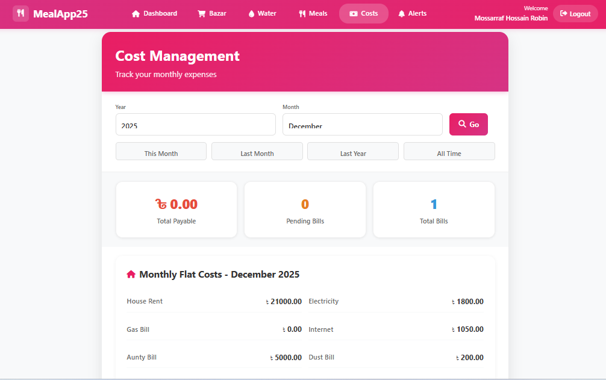
      </kbd>
       
      <b>Monthly Cost Overview</b>
       
      Flat cost overview including rent, electricity, gas, internet, and other bills.
    </td>
    <td align="center" width="50%">
      <h3>Notification Center</h3>
      <kbd>
        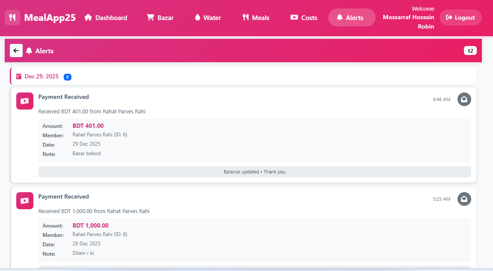
      </kbd>
       
      <b>Alerts & Notifications</b>
       
      Payment notifications with amount, member, date, note, and balance update status.
    </td>
  </tr>
</table>

---

### Payment & OTP Flow

<table>
  <tr>
    <td align="center" width="50%">
      <h3>Send Money</h3>
      <kbd>
        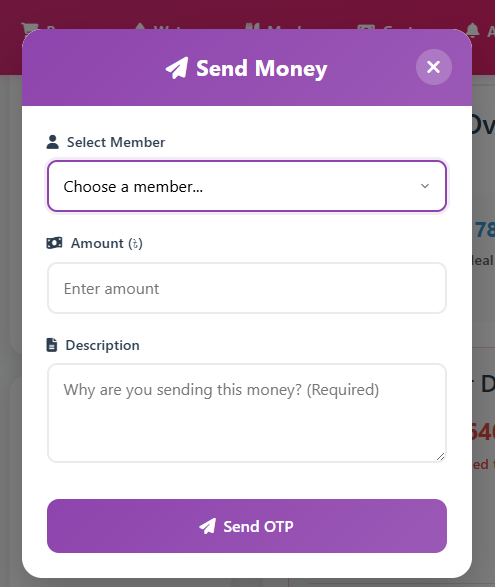
      </kbd>
       
      <b>Send Money Request</b>
       
      Member selection, amount input, description, and OTP request flow.
    </td>
    <td align="center" width="50%">
      <h3>OTP Verification</h3>
      <kbd>
        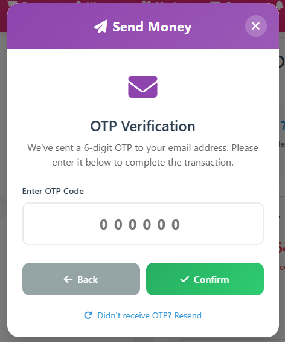
      </kbd>
       
      <b>Secure Transaction Confirmation</b>
       
      Email-based six-digit OTP verification for transaction confirmation.
    </td>
  </tr>
</table>

---

### Existing Desktop & Mobile Views

<table>
  <tr>
    <td align="center" colspan="2">
      <h3>Navigation Experience</h3>
      <kbd>
        
      </kbd>
       
      <b>Navigation Bar</b>
       
      User panel navigation with dashboard, bazar, water, meals, costs, alerts, and logout.
    </td>
  </tr>

  <tr>
    <td align="center" width="50%">
      <h3>Dashboard</h3>
      <kbd>
        
      </kbd>
       
      <b>Dashboard Overview</b>
       
      User dashboard with monthly balance, bazar cost, meal summary, rent, and due calculation.
    </td>
    <td align="center" width="50%">
      <h3>Bazar Section</h3>
      <kbd>
        
      </kbd>
       
      <b>Bazar Management</b>
       
      Bazar entry and expense tracking interface for monthly shared cost management.
    </td>
  </tr>
</table>

---

### Mobile Views

<table>
  <tr>
    <td align="center" width="25%">
      <kbd>
        
      </kbd>
       
      <b>Mobile Dashboard</b>
    </td>
    <td align="center" width="25%">
      <kbd>
        
      </kbd>
       
      <b>Bazar Mobile</b>
    </td>
    <td align="center" width="25%">
      <kbd>
        
      </kbd>
       
      <b>Monthly Cost</b>
    </td>
    <td align="center" width="25%">
      <kbd>
        
      </kbd>
       
      <b>Alert System</b>
    </td>
  </tr>
</table>

---

### Admin Panel Views

<table>
  <tr>
    <td align="center" width="50%">
      <h3>Admin Login</h3>
      <kbd>
        
      </kbd>
       
      <b>Admin Authentication</b>
       
      Dedicated admin login screen for secure management access.
    </td>
    <td align="center" width="50%">
      <h3>Admin Dashboard</h3>
      <kbd>
        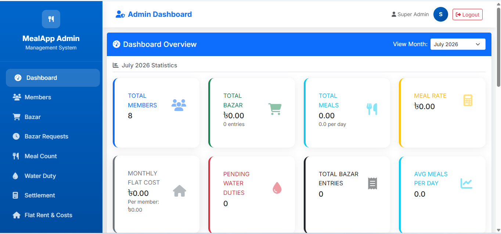
      </kbd>
       
      <b>Dashboard Overview</b>
       
      Admin overview with members, bazar, meals, meal rate, flat cost, duties, and statistics.
    </td>
  </tr>

  <tr>
    <td align="center" width="50%">
      <h3>Member Control</h3>
      <kbd>
        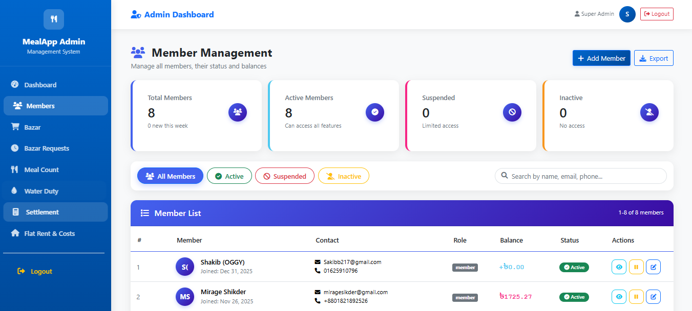
      </kbd>
       
      <b>Member Management</b>
       
      Manage members, active status, suspended users, inactive users, balance, and actions.
    </td>
    <td align="center" width="50%">
      <h3>Bazar Entry</h3>
      <kbd>
        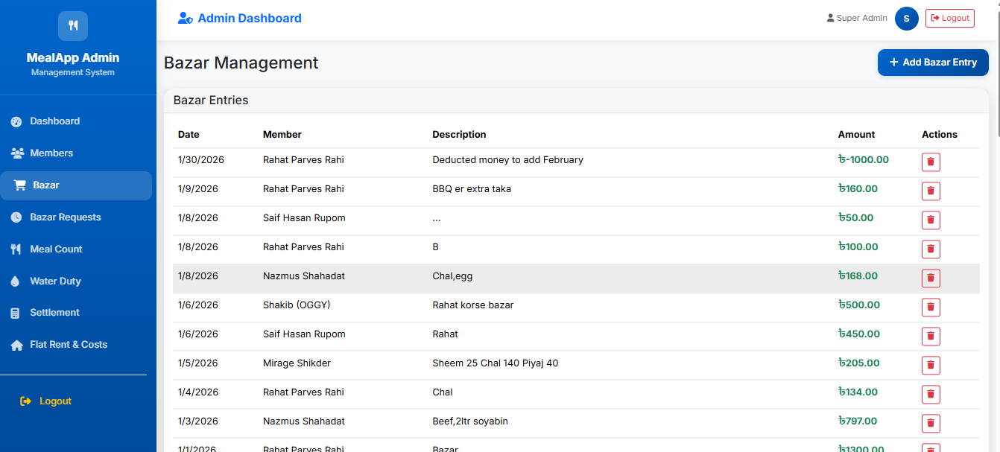
      </kbd>
       
      <b>Bazar Management</b>
       
      Monthly bazar entries with date, member, description, amount, and delete actions.
    </td>
  </tr>

  <tr>
    <td align="center" width="50%">
      <h3>Bazar Request</h3>
      <kbd>
        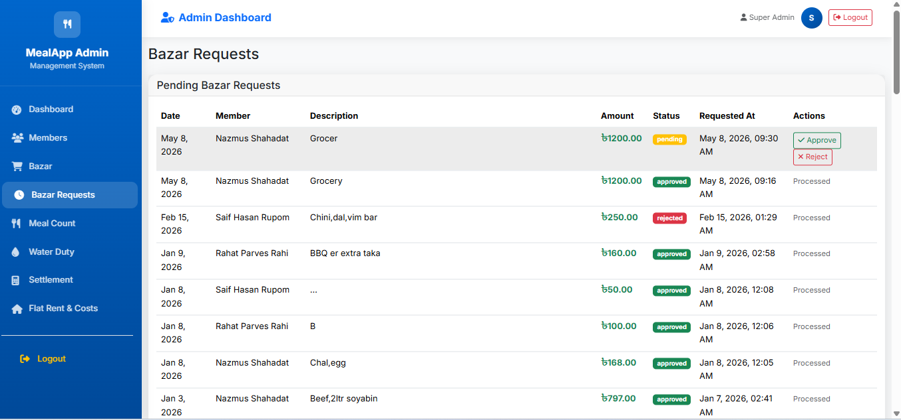
      </kbd>
       
      <b>Bazar Request Approval</b>
       
      Admin approval and rejection system for member bazar requests with status tracking.
    </td>
    <td align="center" width="50%">
      <h3>Meal Entry</h3>
      <kbd>
        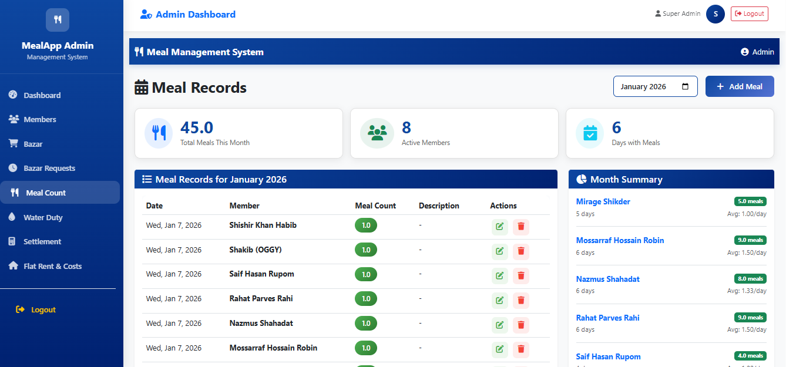
      </kbd>
       
      <b>Meal Entry Management</b>
       
      Meal records, monthly meal count, active members, tracked days, and member summary.
    </td>
  </tr>

  <tr>
    <td align="center" width="50%">
      <h3>Water Duty</h3>
      <kbd>
        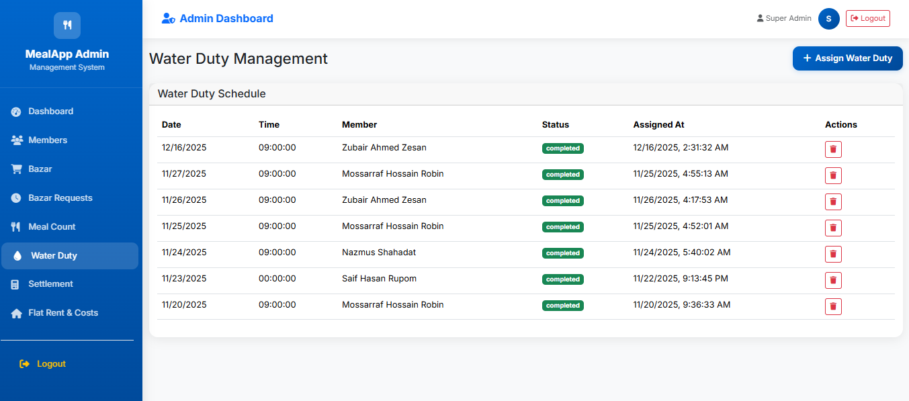
      </kbd>
       
      <b>Water Duty Management</b>
       
      Water duty schedule with date, time, member, status, assigned time, and actions.
    </td>
    <td align="center" width="50%">
      <h3>Settlement</h3>
      <kbd>
        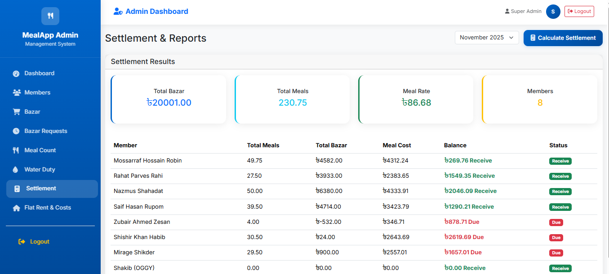
      </kbd>
       
      <b>Settlement & Reports</b>
       
      Settlement calculation with total bazar, total meals, meal rate, balance, receive, and due status.
    </td>
  </tr>

  <tr>
    <td align="center" colspan="2">
      <h3>Flat Rent & Cost Allocation</h3>
      <kbd>
        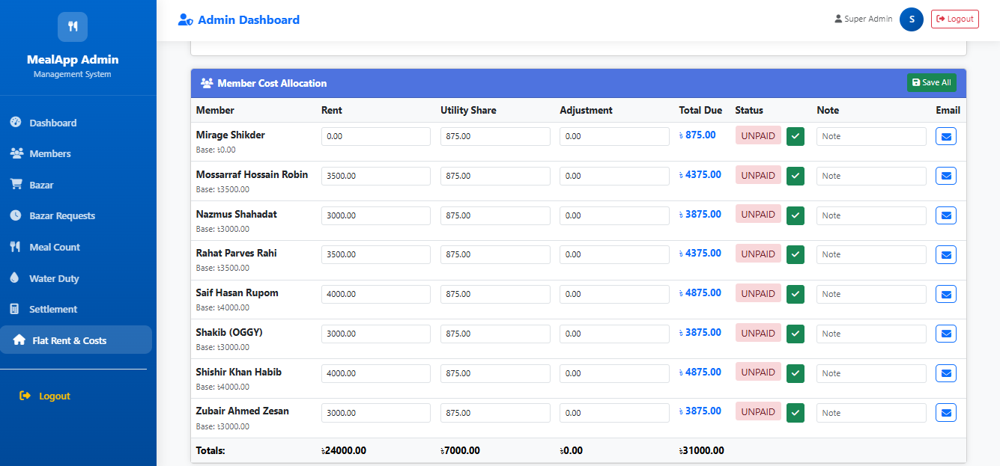
      </kbd>
       
      <b>Flat Rent & Monthly Cost Allocation</b>
       
      Member-wise rent, utility share, adjustment, total due, payment status, notes, and email actions.
    </td>
  </tr>
</table>

## 🤝 Let's Connect

I am open to collaboration, internships, freelance work, and full-stack project opportunities.

<h3>Thanks for visiting my GitHub profile</h3>

