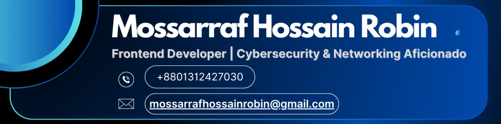
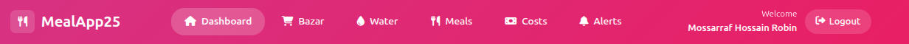
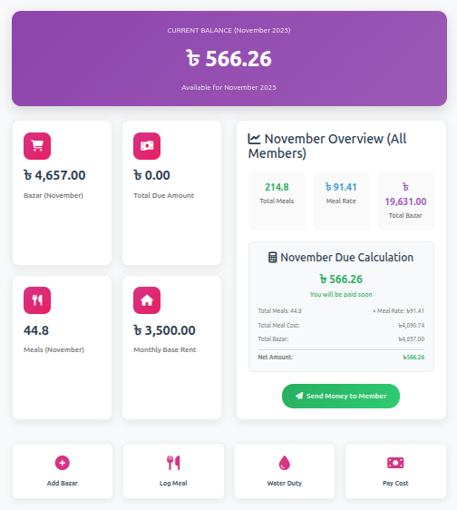
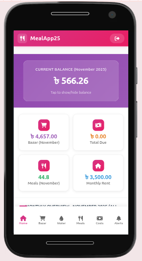
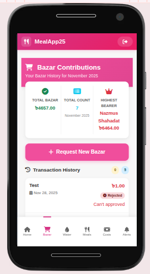
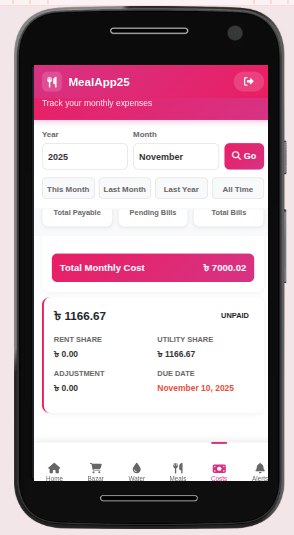
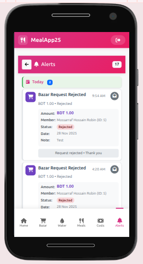
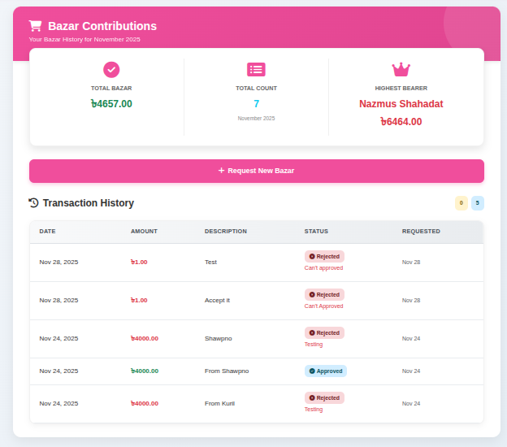

<h3>🎓 CSE Student at Green University of Bangladesh, Dhaka</h3>

  <b>Full-Stack Developer</b> | <b>Cybersecurity Enthusiast</b> | <b>Problem Solver</b> 
  Building modern, responsive, secure, and scalable web applications.

 

## 📌 About Me

I am <b>Mossarraf Hossain Robin</b>, a passionate 

and <b>Computer Science and Engineering student</b> focused on building modern, responsive, secure, and scalable web applications.

I enjoy transforming real-world problems into practical digital solutions using clean UI design, structured backend logic, database management, authentication systems, dashboard features, and user-friendly workflows.

My development stack includes **React.js, Next.js, JavaScript, Tailwind CSS, Firebase, Firestore, Node.js, Express.js, MongoDB, MySQL, PHP, and REST APIs**. I work on both frontend and backend parts to build complete, functional, and production-ready web applications.

I am also deeply interested in **Cybersecurity**, secure coding practices, authentication, data protection, and building applications that are not only beautiful but also reliable and safe for users.

---

## 💻 Tech Stack

  
  
  
  
  
  
  

  
  
  
  
  
  
  

  
  
  
  
  
  
  
  

  
  
  
  
  
  
  
  
  
  

---

## 🚀 Featured Projects

<b>Selected projects showcasing full-stack development, responsive UI, database integration, dashboards, and real-world problem solving.</b>

 

<table>
<thead>
<tr>
<th>Project</th>
<th>Description</th>
<th>Tech Stack</th>
<th>Repository</th>
<th>Live Site</th>
</tr>
</thead>
<tbody>

<tr>
<td><b>KaazBazar</b></td>
<td>Service marketplace platform for local service booking and management.</td>
<td>

</td>
<td>

</td>
<td>

</td>
</tr>

<tr>
<td><b>Meal App 25</b></td>
<td>Bazar, meal count, monthly cost, duty, alerts, and member activity system.</td>
<td>

</td>
<td>

</td>
<td>

</td>
</tr>

<tr>
<td><b>NetOptima</b></td>
<td>Browser-based network diagnostic dashboard and IP analyzer.</td>
<td>

</td>
<td>

</td>
<td>

</td>
</tr>

<tr>
<td><b>AgroCulture</b></td>
<td>Agricultural marketplace for farmers and buyers.</td>
<td>

</td>
<td>

</td>
<td>

</td>
</tr>

<tr>
<td><b>MyPortfolio</b></td>
<td>Personal portfolio website showcasing skills, projects, and contact information.</td>
<td>

</td>
<td>

</td>
<td>

</td>
</tr>

<tr>
<td><b>OneBite</b></td>
<td>Restaurant website with online food ordering and responsive menu browsing.</td>
<td>

</td>
<td>

</td>
<td>

</td>
</tr>

<tr>
<td><b>Elite Footwear</b></td>
<td>Online shoe store with product browsing, cart, and purchase features.</td>
<td>

</td>
<td>

</td>
<td>

</td>
</tr>

<tr>
<td><b>Prottoy Foundation</b></td>
<td>Charity platform with donation, awareness, event, and volunteer sections.</td>
<td>

</td>
<td>

</td>
<td>

</td>
</tr>

<tr>
<td><b>Line Coding Visualizer</b></td>
<td>Educational simulator for visualizing digital line coding techniques.</td>
<td>

</td>
<td>

</td>
<td>

</td>
</tr>

<tr>
<td><b>Inventory System</b></td>
<td>Java-based inventory system with admin dashboard and order tracking.</td>
<td>

</td>
<td>

</td>
<td>

</td>
</tr>

<tr>
<td><b>Array Multiplier</b></td>
<td>Binary array multiplier with visual steps and sign handling.</td>
<td>

</td>
<td>

</td>
<td>

</td>
</tr>

</tbody>
</table>

---

## 📚 Educational Hub

<table>
<thead>
<tr>
<th>Type</th>
<th>Title</th>
<th>Description</th>
<th>Format</th>
<th>Link</th>
</tr>
</thead>
<tbody>
<tr>
<td>Books</td>
<td><b>Cyber Security</b></td>
<td>Cybersecurity textbook and learning resources.</td>
<td></td>
<td>

</td>
</tr>
<tr>
<td>Assignment</td>
<td><b>Web Programming</b></td>
<td>User registration form with validation and Bootstrap styling.</td>
<td>

</td>
<td>

</td>
</tr>
<tr>
<td>Template</td>
<td><b>LaTeX Lab Report</b></td>
<td>Professional LaTeX template for university lab reports.</td>
<td>

</td>
<td>

</td>
</tr>
</tbody>
</table>

---

## 📊 GitHub Stats

<table align="center">
<tr>
<td align="center" width="50%">
  <b>GitHub Overview</b> 
  
</td>
<td align="center" width="50%">
  <b>Most Used Languages</b> 
  
</td>
</tr>
<tr>
<td align="center" colspan="2">
  <b>Contribution Streak</b> 
  
</td>
</tr>
</table>

---

## 📈 Detailed Statistics

<table align="center">
<tr>
<td align="center" colspan="2">
  <b>Profile Summary</b> 
  
</td>
</tr>
<tr>
<td align="center" width="50%">
  <b>Productive Time</b> 
  
</td>
<td align="center" width="50%">
  <b>Repositories Per Language</b> 
  
</td>
</tr>
<tr>
<td align="center" width="50%">
  <b>Commits Per Language</b> 
  
</td>
<td align="center" width="50%">
  <b>Profile Details</b> 
  
</td>
</tr>
</table>

---

## ⚡ Activity Graph

<table align="center">
<tr>
<td align="center">

</td>
</tr>
</table>

---

## MealApp25 Project Showcase

MealApp25 is a web application for managing meal count, bazar cost, monthly expenses, member activities, duty assignment, and alerts.

<table>
<tr>
<td align="center" width="25%">

<b>Mobile Dashboard</b>
</td>
<td align="center" width="25%">

<b>Bazar Mobile</b>
</td>
<td align="center" width="25%">

<b>Monthly Cost</b>
</td>
<td align="center" width="25%">

<b>Alert System</b>
</td>
</tr>
</table>

---

## 🤝 Let's Connect

I am open to collaboration, internships, freelance work, and full-stack project opportunities.

<h3>Thanks for visiting my GitHub profile</h3>

